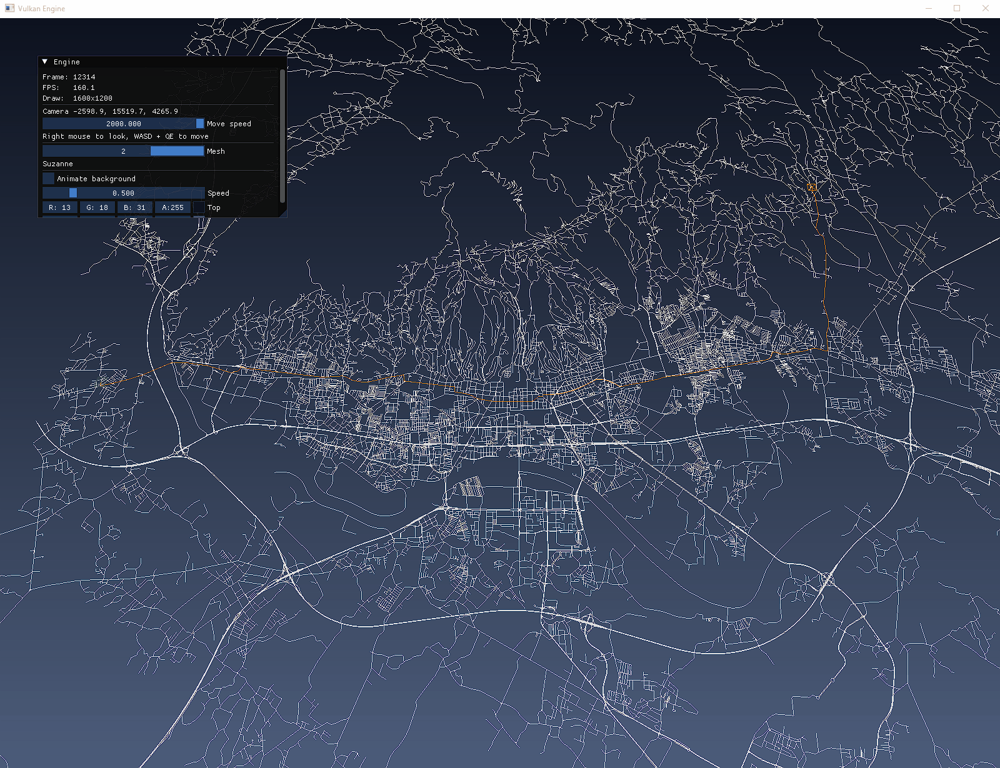

# Routing Engine

A real-time route search visualiser for OpenStreetMap road networks, built on a Vulkan renderer I wrote from scratch in C++.

<p align="center">
  
</p>

- Parses OpenStreetMap `.osm.pbf` extracts into a directed road graph, including one-way streets, roundabouts and motorways
- Keeps the real shape of every road, so curves are drawn as curves instead of straight lines between intersections
- Runs Dijkstra or A* between any two clicked points and draws the route on top of the map
- Animates the search on the GPU, showing every road in the order the algorithm reached it
- Only lets clicks snap to the citys main road network, so a route always exists
- Renders the entire road network of a city (200,000+ line segments) in a single draw call

| | |
|---|---|
| Intersections | 29,048 |
| Directed edges | 62,322 |
| Road segments | 34,628 |
| Shape points | 227,784 |
| Vertices explored by Dijkstra | 48.6% of the graph |
| Vertices explored by A* | 16.0% of the graph |
| Average query, Dijkstra / A* | 20.8 ms / 7.6 ms |

A* explores about three times less of the city and returns exactly the same distances.


## Building

Requirements:

- A C++23 compiler (tested with MSVC on Windows)
- CMake 3.25+
- Vulkan SDK 1.3 or newer


```
cmake --preset debug
cmake --build --preset debug
```
